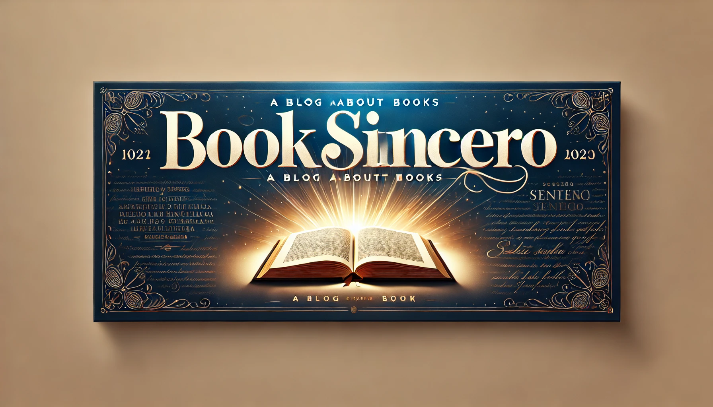

# **Book Sincero**

## PROJETO INTEGRADOR - PROZ - TURMA 35 - GRUPO 05 📚

### Desenvolvimento de um blog literário com no mínimo 5 páginas interativas. 
- O tema escolhido é um blog de resenhas e opiniões sobre livros em geral.
- Ao final de cada texto haverá um link para compra do livro na Amazon e espaço para comentários.
- Poderá ter uma pagina para venda de produtos relacionados aos livros, como itens colecionavéis e filmes.
- Poderá ter uma página para realização de desafios de leituras.

## **Cronograma de Entregas**  

| **Sprint**                | **Data de Entrega** | **Descrição**                               |
|---------------------------|---------------------|---------------------------------------------|
| 1️⃣ **Primeira Sprint**   | 17/10              | Definição do layout das páginas.            |
| 2️⃣ **Segunda Sprint**    | 24/10              | Desenvolvimento do HTML das páginas.        |
| 3️⃣ **Terceira Sprint**   | 26/11              | Estilização das páginas com CSS.            |
| 4️⃣ **Quarta Sprint**     | 17/12              | Funcionalidades interativas com JavaScript. |
| 5️⃣ **Quinta Sprint**     | 14/01              | Dicas para apresentação.                    |
| 🔥 **Entrega Final**      | 21/01              | Apresentação final do projeto.              |

---

## Tarefas 🔍

| **Tarefa** | **Status** |
|-----------------|------------|
| 🌐 Escolher um tema (e-commerce, blogs, site de negócios) |✔️|
| 🛠️ Desenvolver um site sobre o tema, com minimo 05 telas |✔️|
| 🛠️ Desenvolver o layout de cada tela|✔️|
| 🛠️ Desenvolver o HTML de cada tela|✔️|
| 🛠️ Desenvolver o CSS de cada tela|✔️|
| 🛠️ Desenvolver o javascript de cada tela|✔️|
| 🛠️ Entrega Final do Projeto||

--- 

### 📦 Funcionalidades
- Páginas dinâmicas e responsivas.  
- Carrosséis interativos para resenhas e lançamentos.  
- Modais para exibição de resenhas completas.  
- Links úteis para desafios, Amazon e recursos literários.  
- Integração com PDF e links externos.  

---

### 🛠️ Tecnologias Utilizadas

---

### Referências 🛠️

- W3SCHOOLS: https://www.w3schools.com/tags/default.asp

---

### Desenvolvido por: ✍️

<a href="https://avatars.githubusercontent.com/u/123896356?v=4">
   
    
   <b style="color: yellow;">Jessica Fernandes</b>
</a>

  

<a href="https://github.com/priscilaregsilva">
   
    
   <b style="color: yellow;">Priscila</b>
</a>
 
